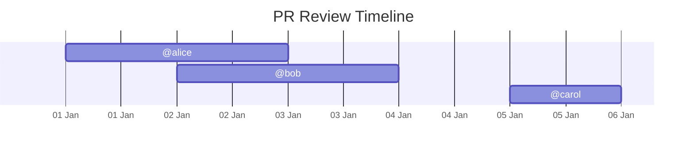

# PR Review Timeline

A GitHub Action that visualizes pull request review participation as a Mermaid Gantt chart directly in the PR description, as well as in the Github Action Summary.

Each reviewer appears as a single bar from the time they started participating (earliest of review requested, assignment, or first review) until the earliest of approval or PR merge; open PRs render to today. Same-day windows are normalized to one day.

## What this shows

For each reviewer:

- Start: earliest of review requested, assignment, or first review (drive-by)
- End: earliest of approval or PR merged/closed; else today
- Same-day windows normalize to one day for correct rendering

This answers one question clearly:

“How long was each reviewer involved in this PR?”

## Example Output



## Usage

```yaml
name: PR Review Timeline

on:
  pull_request:
    types: [opened, reopened, review_requested, assigned, ready_for_review, closed]
  # Trigger when a review is submitted (approvals / changes requested / comments)
  pull_request_review:
    types: [submitted, dismissed]
  # For forked PRs: run in base repo context, safer for writes
  # Do not checkout or execute fork code in this job
  pull_request_target:
    types: [opened, reopened, review_requested, assigned, ready_for_review, closed]

jobs:
  timeline:
    runs-on: ubuntu-latest
    permissions:
      # Minimal permissions to read contents
      contents: read
      # Set pull-requests: write only when you enable `publish-to-pr: true`
      # Otherwise use pull-requests: read for compute-only runs
      pull-requests: write
    steps:
      - uses: shreyas-s-rao/pr-review-timeline@v0.2.0
        id: timeline
        with:
          # Optional: override token (default: ${{ github.token }})
          github-token: ${{ secrets.MY_PAT }}
          # Optional: skip draft PRs (default: true)
          skip-draft: true
          # Optional: publish Mermaid diagram to PR body (default: false)
          publish-to-pr: true
        # Action outputs: timeline-json (reviewer windows), timeline-mermaid (diagram)
      - name: Output timeline JSON
        run: |
          echo '${{ steps.timeline.outputs.timeline-json }}' > timeline.json
      - uses: actions/upload-artifact@v4
        with:
          name: pr-review-timeline
          path: timeline.json
```

## Testing

Run a local test against a real PR using the same code as the Action:

```bash
# Quick setup: copy and source env file
cp scripts/env.example scripts/env.local
# edit scripts/env.local with your values
source scripts/env.local

# Build importable JS from src/
npm run build:lib

# Print Mermaid Gantt using core modules
npm run test
```

## Contributing

This project was largely vibe-coded using GitHub Copilot, so there may be rough edges. Contributions via issues and PRs are most welcome!
